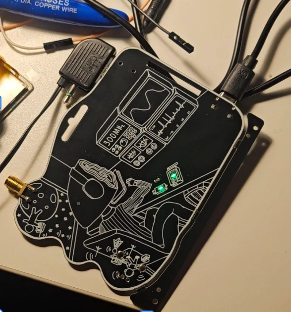

# hfsdr

HFSDR: host software, firmware, and hardware design for the HFSDR USB device.

## Getting started

Portable Mode (not connected to a PC)

1. Press the Rotary Encoder to 
    1. Enable/ Disable FM Audio Out mode (on disabled, it plays a constant tone)
    2. Cycle through different LED modes
<!--2. Turn the radio to change the FM Radio Frequency-->

Connected to a PC

1. Go to [the web ui](https://hackin7.github.io/lain-sdr-chall)
2. Connect & Pair a device
3. Set the frequency & gain
4. Pair the device again
5. Waterfall of the wireless world should start. If it doesn't look like [this](https://hackin7.github.io/lain-sdr-chall/assets/sample-C2LA0HHR.png), unplug the device and try again

- **User manual (slides):** [HFSDR User Manual](https://docs.google.com/presentation/d/1T5zb-2KSN37Saw5E9nwcajVOSR3CzVYfAOpIypQLBcQ/edit?usp=sharing)
- **Step-by-step instructions:** [lain-sdr-ui](https://hackin7.github.io/lain-sdr-chall)
- **Host testing (Python probe, GNU Radio `.grc` examples, drivers, protocol):** [docs/host-guide.md](docs/host-guide.md)

## Troubleshooting

- **USB / stream flaky:** Unplug the board or reset it a few times. The host stack sometimes needs a power cycle before enumeration, WinUSB binding, or streaming stabilizes.
- **Using with GNURadio/ Python Scripting:** See the driver and probe sections in [docs/host-guide.md](docs/host-guide.md).

## Repository layout

| Path | Contents |
|------|----------|
| `ch32v305/` | Firmware (CH32V305). Build, flash, toolchain: [ch32v305/README.md](ch32v305/README.md). |
| `client-sw/` | Host Python (`hfsdr_probe`, PyUSB helpers), GNU Radio blocks and examples (`gr-hfsdr-lib`, `.grc`). |
| `docs/` | [host-guide.md](docs/host-guide.md) — primary host-side documentation. |
| `hardware/` | KiCad project and related hardware files. |
| `scripts/` | Helper scripts (e.g. udev `99-hfsdr.rules`, Windows USB checks). |
| `ui/` | WebUSB Web UI (Svelte/Vite). Deployed build: `homepage` in [ui/package.json](ui/package.json). |

## Credits

1. rhgndf - hard carry schematic & everything inside actually
2. Hackin7 - Art, PCB rough layout & routing & some embedded
3. Hack & Roll Cursor Credits + Codex - allow us to do this while being overseas/ having full time jobs